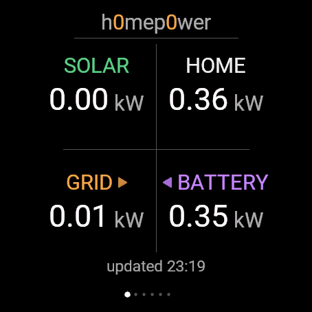
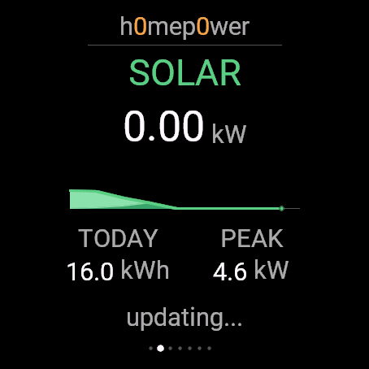
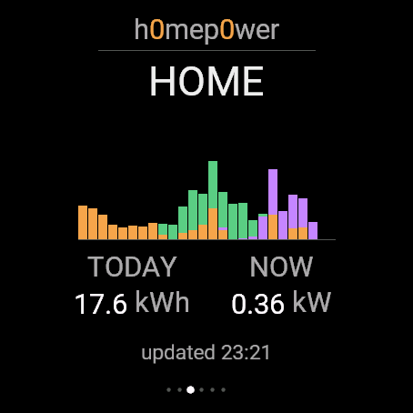
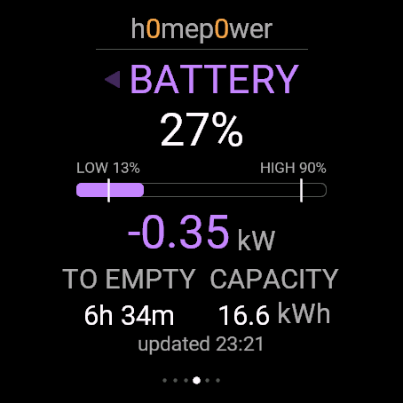
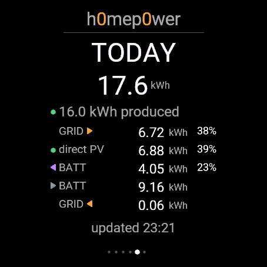
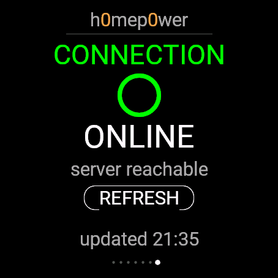

# Home Power for Garmin Fēnix 8 (47 mm AMOLED)

A native Garmin Connect IQ watch app for the 454×454 AMOLED Fēnix 8 target, showing live solar/home/grid/battery power from a [h0me-p0wer](https://github.com/lucianhanga/h0me-p0wer) backend. Colors match that web app's brand convention: solar green, grid orange, battery violet (grey while charging), home neutral.

## Screens

| Overview | Solar | Home |
|---|---|---|
|  |  |  |

| Battery | Today | Connection |
|---|---|---|
|  |  |  |

1. **Overview** — the live view: all four metrics at a glance, 2×2 grid, no +/- signs - Grid and Battery instead show a pulsing drawn triangle for direction (export/discharge before the word, import/charge after - same pattern both cells share)
2. **Solar** — a stacked-area graph spanning the whole day (0h–24h on the x-axis) - PV→battery stacked under PV→home, total production traced on top, same composition as the web app's Graph tab - with a pulsing dot marking "now", plus today's total and peak
3. **Home** — 24 fixed hourly stacked bars (grid base, battery middle, solar remainder on top), matching the web app's Dashboard stacked-bar composition, plus today's total and the current rate
4. **Battery** — charge %, a fill bar with LOW/HIGH SOC threshold markers, charge/discharge rate, "TO FULL"/"TO EMPTY" time estimate, capacity - the title carries the same direction triangle as Overview's Battery cell
5. **Today** — a breakdown matching the web app's Dashboard "today" tile: total consumption, produced, then Grid/direct-PV/from-battery/to-battery/to-grid each with kWh (percentages, computed the same way the web app does, only on the three rows that sum to ~100% of consumption)
6. **Connection** — online/offline status, manual retry

Click/tap the watch face (or press **START/ENTER**) to advance a page; the last page retries the connection instead of advancing.

## Quick start: run it in the simulator

```sh
./scripts/run-simulator.sh
```

This kills any stuck simulator, relaunches it, rebuilds the app, and pushes it in — one command. If the simulator ever shows a blue pause/sleep triangle and stops responding, re-run this script rather than trying to wake it manually (it doesn't reliably wake on its own).

Prefer VS Code? Install the **Monkey C** extension, open any `.mc` file under `source/`, and press **Cmd+F5** (**Ctrl+F5** on Windows/Linux) — same effect, one step.

## Demo mode vs. live data

`source/Config.mc`:

```monkeyc
const USE_DEMO_DATA = false;

const API_URL =
    "https://h0me-p0wer.lucianhanga.stream/api/watch/status";

const API_TOKEN = "";
```

With `USE_DEMO_DATA = true` the app runs standalone with static demo values — useful for compiling/testing without a backend. Set it to `false` (the current default) to pull live data from `API_URL` every 15s.

### API_TOKEN

The backend's `/api/watch/status` is optionally gated behind a shared token (see the `h0me-p0wer` repo's `server/auth.js`/`npm run token:generate`). Leave `API_TOKEN = ""` while the backend has no token configured — requests go through unauthenticated, same as before. Once a token exists, set `API_TOKEN` to that exact value here (sent as `Authorization: Bearer <token>`) and rebuild/reinstall. Tokens last 4 weeks; renewal is manual — regenerate on the backend, update this constant, rebuild, reinstall.

## Expected JSON

`GET /api/watch/status` should return this flat structure (every field is optional — the watch merges whatever arrives onto its cached defaults):

```json
{
  "solar": 4.21,
  "home": 1.87,
  "grid": -2.34,
  "battery": 78,
  "batteryPower": 1.20,
  "batteryCapacity": 14.2,
  "batteryMinutesToFull": 195,
  "batteryMinutesToEmpty": 340,
  "batteryFloorPct": 10,
  "batteryMaxPct": 95,
  "solarToday": 18.4,
  "solarDirectToday": 6.9,
  "homeToday": 22.6,
  "exportedToday": 18.1,
  "importedToday": 6.4,
  "batteryDischargedToday": 3.8,
  "batteryChargedToday": 9.2,
  "solarHistory": [0.4, 0.7, 1.1, 1.8, 2.6, 3.4, 4.0, 4.4],
  "solarBatteryHistory": [0.0, 0.1, 0.3, 0.6, 0.9, 1.2, 1.4, 1.5],
  "homeHistory": [1.2, 1.6, 1.3, 1.1, 1.0, 1.2, 1.4, 1.7],
  "homeFromGridHistory": [1.2, 1.6, 1.3, 1.1, 1.0, 1.2, 1.4, 1.3],
  "homeFromBatteryHistory": [0.0, 0.0, 0.0, 0.0, 0.0, 0.0, 0.0, 0.2],
  "gridHistory": [-0.8, -1.1, -1.6, -2.1, -2.4, -2.8, -3.1, -3.0]
}
```

`grid`: negative = exporting, positive = importing. `batteryPower`: positive = charging, negative = discharging. `solarToday` is total production; `solarDirectToday` is the PV-direct-to-home portion of it (a smaller number). `batteryDischargedToday`/`batteryChargedToday` are cells-only, excluding PV pass-through. The `*History` arrays feed the Solar day graph and Home stacked bars — they span from local midnight to now, one point per hour. `solarBatteryHistory` is the portion of each `solarHistory` sample routed to the battery (same cadence/length) — the Solar graph stacks it under the PV→home remainder beneath the total production line. `homeFromGridHistory`/`homeFromBatteryHistory` split `homeHistory` the same way for the Home page's stacked bars (grid base, battery middle, solar remainder — `homeHistory[i] - homeFromGridHistory[i] - homeFromBatteryHistory[i]` — on top). Any array shorter than its sibling (e.g. still demo-fallback) is nearest-neighbor resampled onto the real array's index range rather than truncating it.

## Installing on the real watch

1. Build a signed `.prg`: either `./scripts/run-simulator.sh` (it builds as a side effect, same artifact works on-device since it's already signed) or VS Code's **Monkey C: Build for Device** → **fēnix 8 47 mm / 51 mm**.
2. Connect the watch via USB.
3. Copy `bin/HomePower.prg` into the watch's `GARMIN/APPS/` folder.
4. Safely disconnect, then find **Home Power** in the watch's Activities & Apps list (press **START** from the watch face).

### macOS note: if the watch doesn't show up as a drive

Some Garmin watches default to **MTP** USB mode, which **macOS Finder cannot browse** (no built-in MTP support, unlike Windows) — the watch will connect, show a charging/eject icon, and the Mac will still show nothing in Finder or `/Volumes`. Two fixes:

- **Preferred**: on the watch, switch USB mode from **MTP** to **Garmin** (Settings → System → USB, or wherever your model exposes it) — this is the standard mass-storage mode and should mount normally in Finder.
- **If that's not available or doesn't stick**: install an MTP client, e.g. [OpenMTP](https://github.com/ganeshrvel/openmtp) (`brew install --cask openmtp`), connect with the watch still in MTP mode, and drag the `.prg` into `GARMIN/APPS/` through that app's window instead of Finder.

If the connection keeps dropping (watch icon flickers, nothing stays mounted long enough), that's usually the magnetic charging clip not seated firmly — reseat it and hold it in place rather than letting it rest under its own weight.

## If the simulator target is missing

Run **Monkey C: Edit Products** in VS Code and ensure the Fēnix 8 AMOLED product is selected. The manifest already contains the current product id `fenix847mm`.

## Developer key

The Garmin toolchain may ask you to generate/select a developer signing key the first time you build for hardware. Follow the prompt from the Monkey C extension/SDK Manager; keep that key private (`.gitignore` already excludes `*.der`/`*.jwt`).
